# Digital Signal Processing:

## Signal A: 
### Signal Plot: 
The following plot is the noisy input signal A:
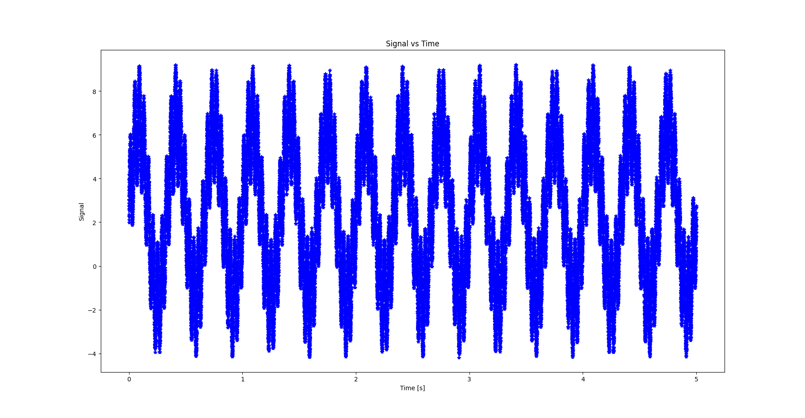

### FFT:
The following plot is the FFT of Signal A:
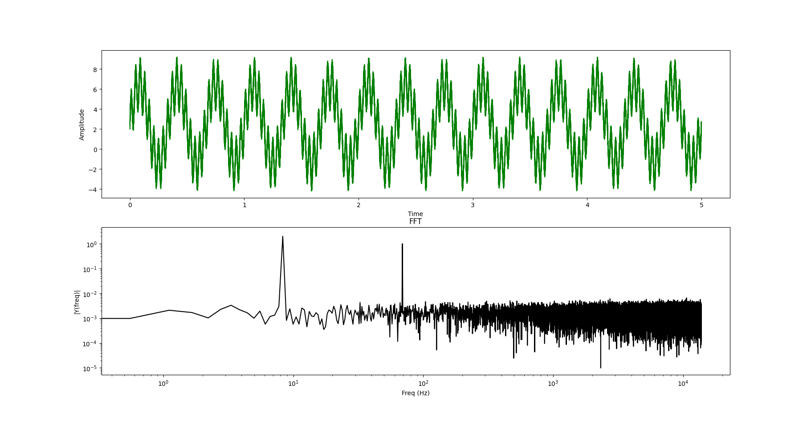

As shown in the figure, there is a lot of noise in the signal caused by many high frequency signals accumulating in the input signal.

### FFT using Moving Average Low Pass Filter for Signal A:
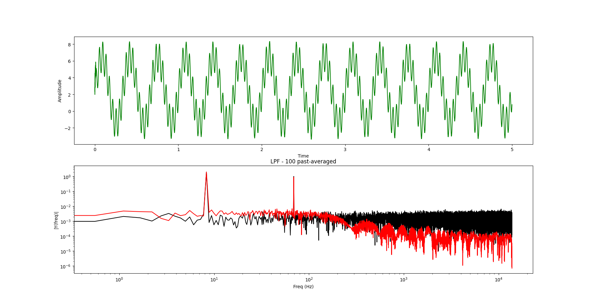

After Applying a moving average of 100 to the signal, many of the high frequency signals were reduced and the signal became much less noisy. This helped clean up the signal as shown in green above.

### FFT using low pass IIR for Signal A:
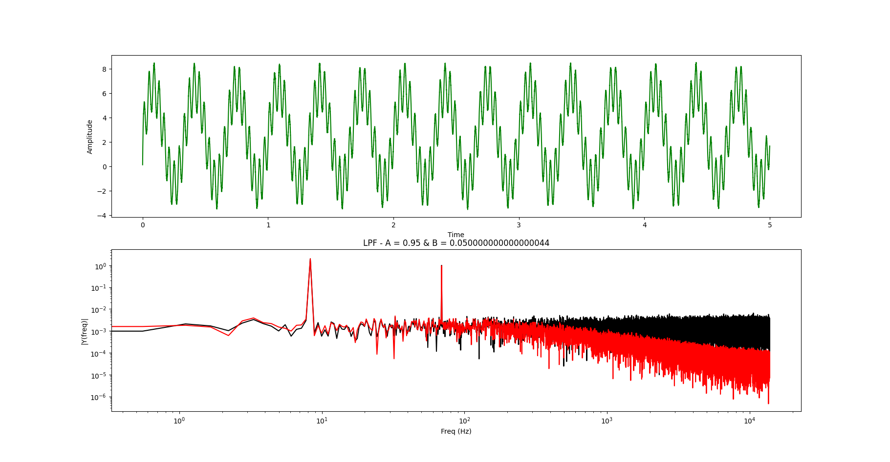

Using an IIR low-pass filter, high-frequency noise was reduced while preserving the overall low-frequency structure of the signal. Compared to the moving average filter, the IIR filter introduces more emphasis to recent samples. With A = 0.95, the response is smoother but introduces noticeable lag in signal changes.

### FFT using low pass FIR for Signal A:
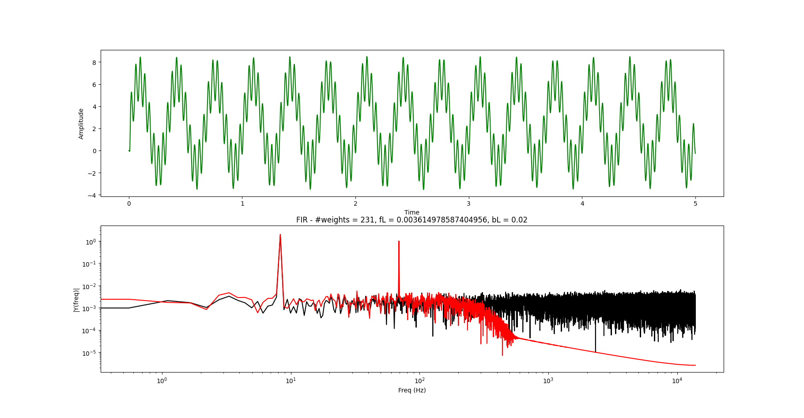

The FIR low pass filter was the most benificial of the three low pass filtering techniques. Applying a cutoff frequency of approximately 100 Hz, and a bandwidth of 0.02. This was an attempt to completely cuttoff the high frequency noise in the signal after 100 Hz. However, given the structure of the noise in the signal, I could not tell much of a difference between it and the IIR filter.

---

## Signal B: 
### Signal Plot: 
The following plot is the noisy input signal B:
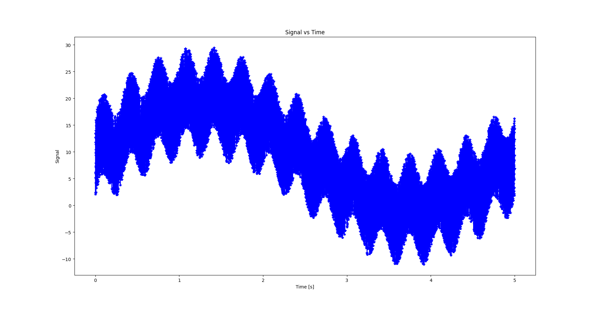

### FFT:
The following plot is the FFT of Signal B:
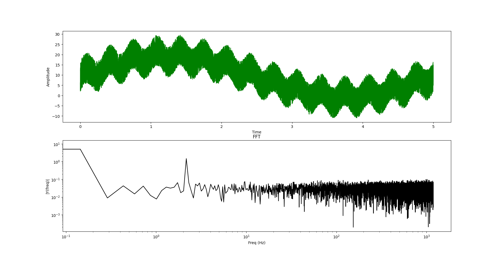

As shown in the figure, there is a lot of noise in the signal caused by many high frequency signals accumulating in the input signal.

### FFT using Moving Average Low Pass Filter for Signal B:
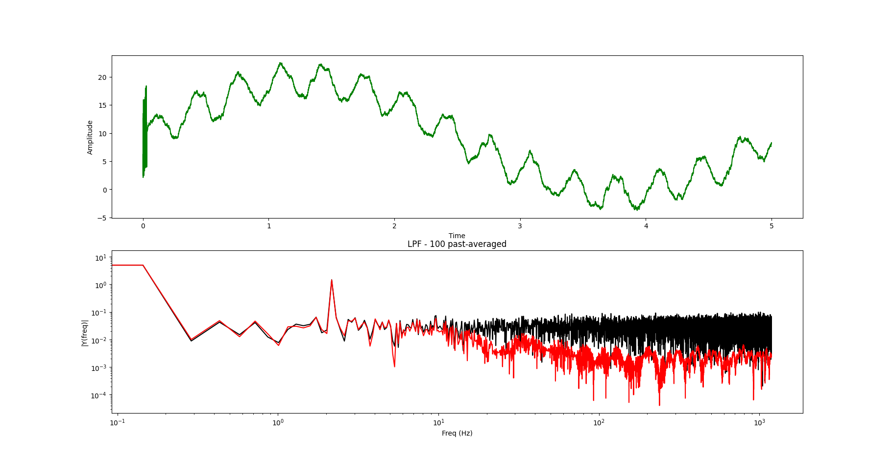

I continued to using a moving average of 100 for Signal B.

### FFT using low pass IIR for Signal B:
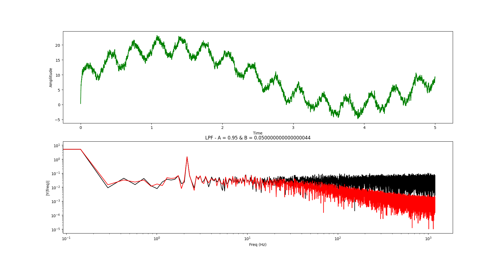

I continued to use A = 0.95 for Signal B.

### FFT using low pass FIR for Signal B:
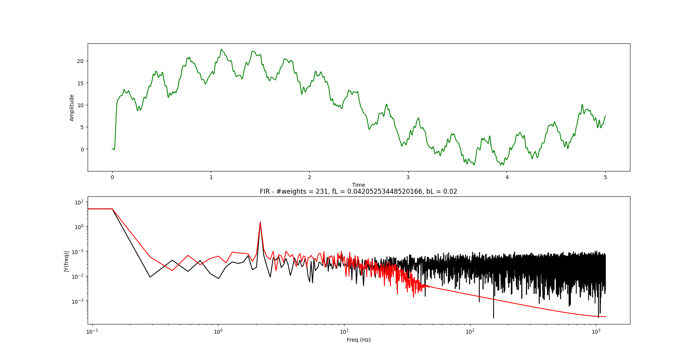

I continued to apply a cutoff frequency of approximately 100 Hz, and a bandwidth of 0.02.

---

## Signal C: 
### Signal Plot: 
The following plot is the noisy input signal C:
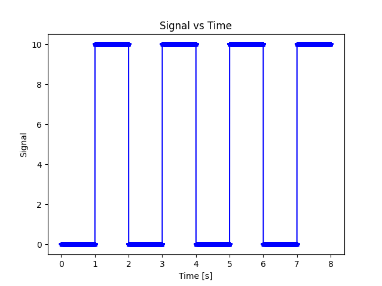

### FFT:
The following plot is the FFT of Signal C:
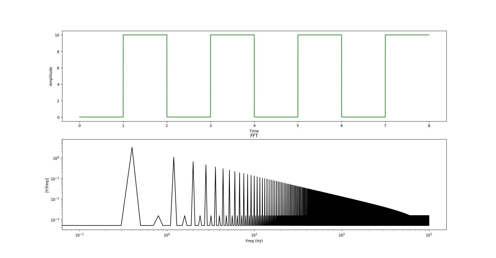

As shown in the figure, there is a lot of noise in the signal caused by many high frequency signals accumulating in the input signal.

### FFT using Moving Average Low Pass Filter for Signal C:
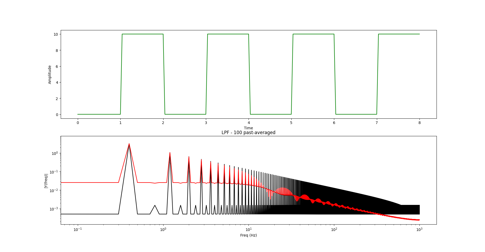

I continued to using a moving average of 100 for Signal C.

### FFT using low pass IIR for Signal C:
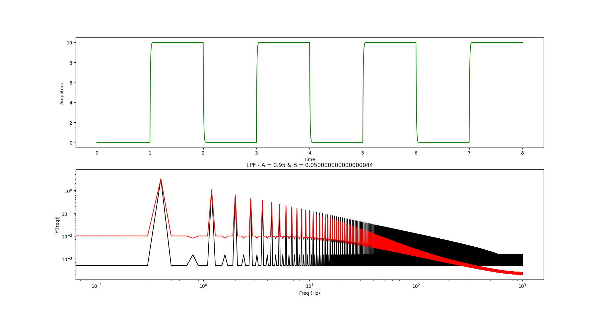

I continued to use A = 0.95 for Signal C. This did round the edges of the top  of the square wave slightly more than the MAF did. 

### FFT using low pass FIR for Signal C:
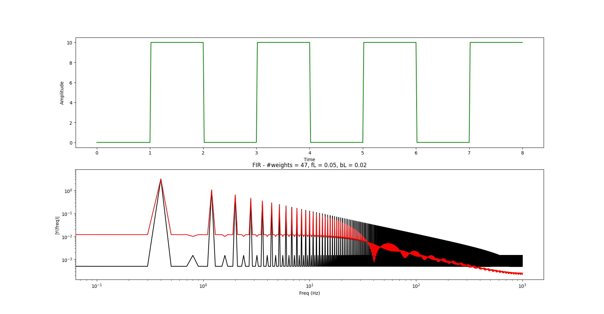

I continued to apply a cutoff frequency of approximately 100 Hz, and a bandwidth of 0.02 for Signal C. However, I switched the window method from Blackman to Rectangular. This helped reduce the number of weights needed, and the computation.

The difference between the filters was less noticible for these signals because there was less noise distributed throughout the system. Much of the noise occured at a large frequency, which most of the filters were able to remove.

---

## Signal D: 
### Signal Plot: 
The following plot is the noisy input signal D:
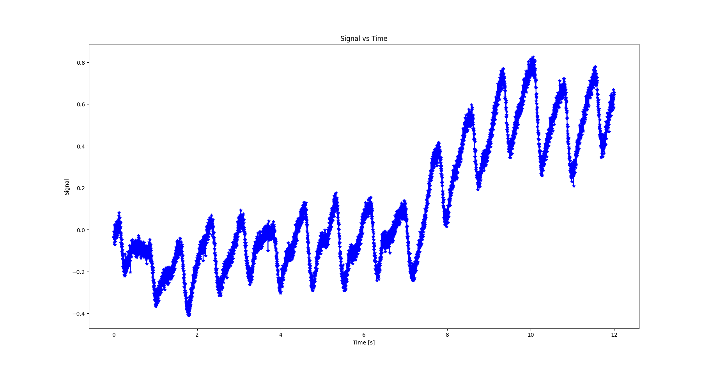

### FFT:
The following plot is the FFT of Signal D:
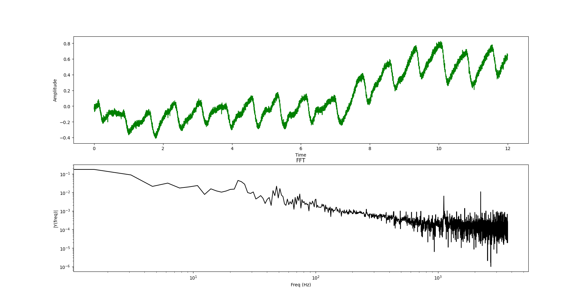

As shown in the figure, there is a lot of noise in the signal caused by many high frequency signals accumulating in the input signal.

### FFT using Moving Average Low Pass Filter for Signal D:
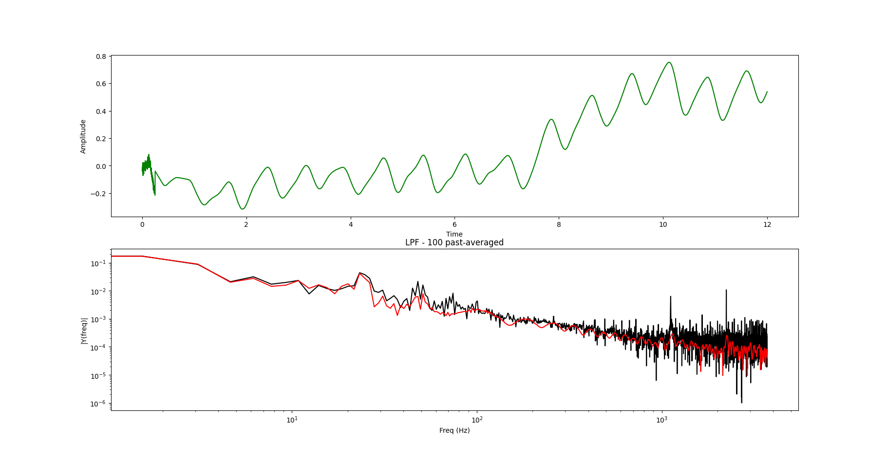

I continued to using a moving average of 100 for Signal D.

### FFT using low pass IIR for Signal D:
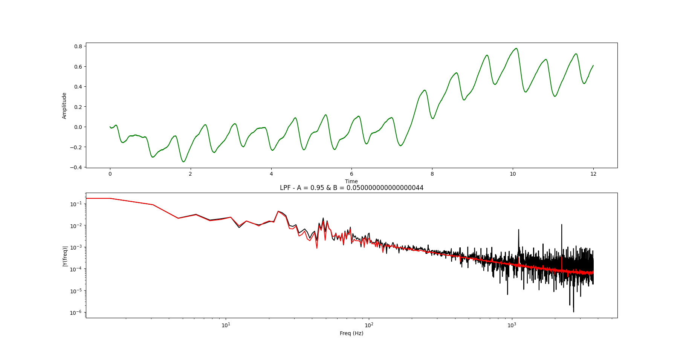

I continued to use A = 0.95 for Signal D. This did round the edges of the top  of the square wave slightly more than the MAF did. 

### FFT using low pass FIR for Signal D:
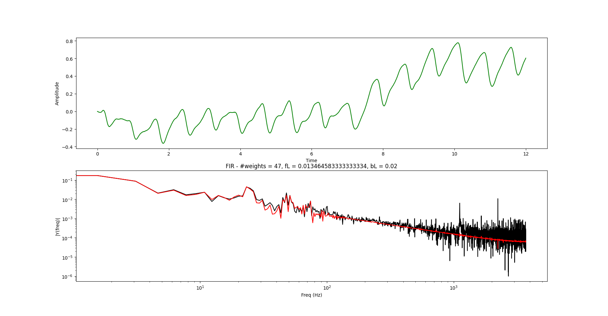

I continued to apply a cutoff frequency of approximately 100 Hz, and a bandwidth of 0.02 for Signal D. I used the Rectangular window for signal D as I did for signal C.

---

Files:
- dsp.py: python file to input signal csv and produce the following signal and FFT/Low Pass filter plots.